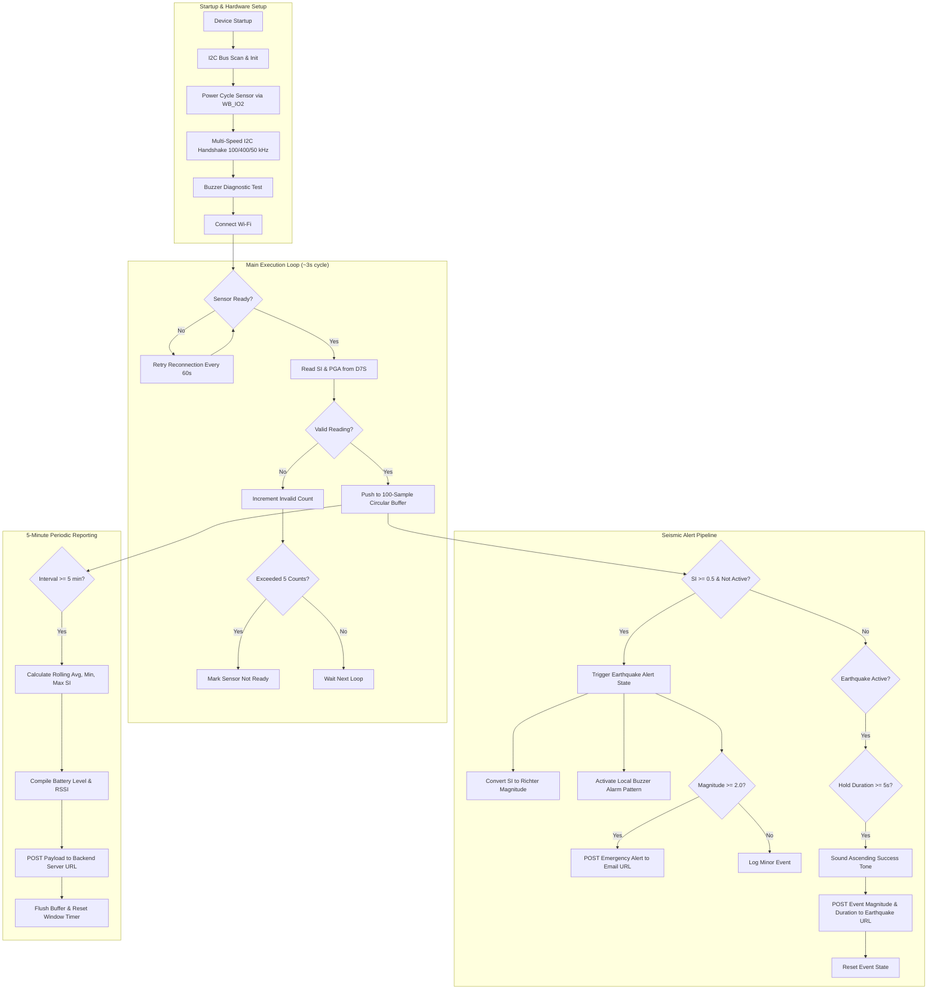

# Queyk IoT: Seismic Sensor and Earthquake Alert System

[](https://docs.rakwireless.com/)
[](https://store.rakwireless.com/products/rak12027-d7s-seismic-sensor)
[](https://www.arduino.cc/)
[](file:///home/luis/dev/projects/QUEYK/queyk-iot/LICENSE)

Arduino firmware for ESP32 and RAKwireless WisBlock hardware designed for real-time seismic sensing, earthquake magnitude estimation, local buzzer alarms, and backend data reporting over Wi-Fi.

---

## 1. Overview & Key Capabilities

**Queyk IoT** runs on an ESP32 micro-controller interfaced with an Omron D7S seismic sensor (via the RAK12027 module) to monitor Spectral Intensity (SI) and Peak Ground Acceleration (PGA). When ground motion exceeds safety thresholds, the device sounds a local alarm buzzer and sends instant HTTP alert notifications to a backend API.

### Key Capabilities

- **Real-Time Seismic Sensing**: Reads Spectral Intensity (SI) and Peak Ground Acceleration (PGA) from the D7S sensor over I2C (`0x55`).
- **Magnitude Estimation**: Converts Spectral Intensity into estimated Richter-scale magnitude ($M$) on-device using empirical piecewise equations.
- **Local & Remote Alerts**:
  - **Local Buzzer**: Emits an audible alarm pattern on pin `WB_IO5` when an earthquake is detected ($SI \ge 0.5$) and plays a completion tone when motion subsides.
  - **Email Notification Webhook**: Sends an instant HTTP POST request to `emailURL` for events $\ge M2.0$.
  - **Event Data Logging**: Posts the final recorded magnitude and duration to `earthquakeURL` after the event clears.
- **5-Minute Periodic Data Reporting**: Aggregates rolling average, minimum, and maximum SI readings along with Wi-Fi signal strength and battery status, posting the summary JSON payload to `serverURL`.
- **Fault Recovery & Sensor Reconnect**:
  - Power cycles the sensor via `WB_IO2` during startup and recovery.
  - Tries multiple I2C clock speeds ($100\,\text{kHz}$, $400\,\text{kHz}$, $50\,\text{kHz}$) if connection fails.
  - Automatically attempts sensor re-initialization every 60 seconds if disconnected.
  - Runs an hourly buzzer self-test beep.

---

## 2. Architecture / How it Works

The firmware runs a main loop every 3 seconds, evaluating live sensor readings, updating circular buffers, handling buzzer states, and sending periodic updates.



### Magnitude Conversion Formula

The device calculates estimated earthquake magnitude ($M$) from measured Spectral Intensity ($SI$) using the following piecewise formula:

$$ \text{Magnitude}(SI) = \begin{cases}
1.0 + (SI \times 2.0) & SI \le 0.5 \\
2.0 + ((SI - 0.5) \times 1.0) & 0.5 < SI \le 1.5 \\
3.0 + \left(\frac{SI - 1.5}{1.5}\right) & 1.5 < SI \le 3.0 \\
4.0 + \left(\frac{SI - 3.0}{3.0}\right) & 3.0 < SI \le 6.0 \\
5.0 + \left(\frac{SI - 6.0}{4.0}\right) & SI > 6.0
\end{cases}$$

---

## 3. Tech Stack

- **Target Hardware**: ESP32 / RAKwireless WisBlock Core (e.g., RAK11200 / ESP32 DevKit)
- **Primary Language**: C++ (Arduino Core)
- **Sensors & Components**:
  - [Omron D7S](https://components.omron.com/us-en/products/sensors/D7S) / [RAK12027](https://store.rakwireless.com/products/rak12027-d7s-seismic-sensor) Seismic Sensor (I2C: `0x55`)
  - Piezo Buzzer (`WB_IO5`)
  - Sensor Power Gate Pin (`WB_IO2`)
- **Libraries**:
  - [`RAK12027_D7S.h`](https://github.com/RAKWireless/RAK12027-D7S): Hardware driver for Omron D7S
  - [`WiFi.h`](https://github.com/espressif/arduino-esp32/tree/master/libraries/WiFi): Wi-Fi connectivity
  - [`HTTPClient.h`](https://github.com/espressif/arduino-esp32/tree/master/libraries/HTTPClient): HTTP POST client with token auth
  - [`Wire.h`](https://github.com/espressif/arduino-esp32/tree/master/libraries/Wire): I2C communication

---

## 4. Project Structure

```
queyk-iot/
├── LICENSE              # MIT License
├── README.md            # Project documentation
└── iot.ino              # Arduino firmware source code
```

### Source Code Overview

- [`iot.ino`](file:///home/luis/dev/projects/QUEYK/queyk-iot/iot.ino):
  - **Config & Network**: Wi-Fi credentials, backend API endpoints, and authentication headers.
  - **Hardware Setup**: I2C bus scanner (`scanI2C()`) and power-cycling routines.
  - **Sensor Management**: Multi-frequency I2C initialization, status checks (`D7S.isReady()`), and SI/PGA data reads.
  - **Circular Buffer**: 100-reading buffer for rolling statistics (average, minimum, maximum).
  - **Alerts & Audio**: Buzzer tone generation (`soundEarthquakeAlarm()`, `soundSuccessTone()`) and HTTP POST dispatchers.

---

## 5. Getting Started

### Prerequisites

1. **Hardware**:
   - ESP32 board or RAKwireless WisBlock Base + Core (RAK5005-O + RAK11200 / RAK4631).
   - RAK12027 (Omron D7S) seismic sensor module mounted flat on a stable surface.
   - Buzzer connected to `WB_IO5` (or configured GPIO pin).
2. **Software**:
   - [Arduino IDE](https://www.arduino.cc/en/software) (v2.0+) or [PlatformIO](https://platformio.org/).
   - ESP32 Board package installed.
   - `RAK12027_D7S` library installed via Library Manager.

### Configuration Variables

Open [`iot.ino`](file:///home/luis/dev/projects/QUEYK/queyk-iot/iot.ino) and update the configuration parameters at the top of the file:

| Variable | Type | Description | Default / Example |
| :--- | :--- | :--- | :--- |
| `ssid` | `const char[]` | 2.4 GHz Wi-Fi network SSID | `"WIFI_SSID"` |
| `pass` | `const char[]` | Wi-Fi network password | `"WIFI_PASSWORD"` |
| `serverURL` | `const char*` | Endpoint for 5-minute periodic status data | `"https://api.example.com/v1/readings"` |
| `emailURL` | `const char*` | Webhook URL for instant email notifications | `"https://api.example.com/v1/alerts/email"` |
| `earthquakeURL` | `const char*` | Endpoint for completed earthquake incident reports | `"https://api.example.com/v1/alerts/earthquake"` |
| `authToken` | `const char*` | API authentication token | `"AUTH_TOKEN"` |
| `tokenType` | `const char*` | Token header type | `"Bearer"` / `"TOKEN_TYPE"` |
| `BUZZER_PIN` | `const int` | GPIO pin connected to buzzer | `WB_IO5` |

### Flashing the Board

1. Plug the ESP32 / WisBlock board into your computer via USB.
2. In Arduino IDE, select your board from **Tools > Board**.
3. Select your serial port under **Tools > Port**.
4. Click **Upload**.
5. Open **Tools > Serial Monitor** and set baud rate to `115200`.

---

## 6. Usage & Data Payloads

### Serial Monitor Output

During normal operation, the board outputs startup diagnostics and periodic status messages:

```text
🔄 === DEVICE STARTUP ===
Board: ESP32-based device
🔧 Initializing I2C...
🔍 Scanning I2C bus...
I2C device found at address 0x55
✅ Found 1 I2C device(s)
⚡ Configuring power control...
🔊 Configuring buzzer...
🔊 Testing buzzer at startup...
🔊 Buzzer test complete
Power cycle 1/3
...
Connecting to WiFi: MyHomeNetwork
✅ WiFi connected: 192.168.1.145
🔧 Trying different I2C configurations...
Trying I2C speed: 100000 Hz
🔧 Attempting D7S initialization...
✅ D7S responds to I2C
✅ D7S.begin() successful
Waiting for sensor ready...
✅ Sensor READY!
✅ Sensor initialized at 100000 Hz
======================

📊 Normal | SI: 0.002 | Magnitude: M1.0 | Rolling Avg: 0.002 | Min: 0.000 | Max: 0.002 | Source: REAL | Email: READY
```

### API Payload Formats

#### 1. Periodic 5-Minute Status (`POST serverURL`)
```json
{
  "siAverage": 0.014,
  "siMinimum": 0.000,
  "siMaximum": 0.082,
  "battery": 99.7,
  "signalStrength": "-64"
}
```

#### 2. Immediate Earthquake Trigger (`POST emailURL`)
```json
{
  "magnitude": 3.4
}
```

#### 3. Completed Event Summary (`POST earthquakeURL`)
```json
{
  "magnitude": 3.4,
  "duration": 6
}
```

---

## 7. Troubleshooting & Common Issues

| Issue / Symptom | Potential Cause | Solution |
| :--- | :--- | :--- |
| `❌ No response from D7S at address 0x55` | Module not seated or power pin off | Check that `WB_IO2` power control is connected and the module is seated securely in its slot. |
| `❌ Sensor TIMEOUT` | Board moved during calibration | Keep the board completely flat and still during startup calibration (`D7S.initialize()`). |
| `⚠️ Invalid sensor reading #N` | I2C wiring noise or loose contacts | Firmware will retry reconnection after 5 invalid readings. You can lower I2C clock speed to `50000 Hz` if needed. |
| `📱 Offline - data not sent` | Wi-Fi disconnect | Verify SSID and password. The device continues running locally and retries sending on subsequent intervals. |
| `⚠️ API Error 401 / 403` | Authentication failure | Verify your `authToken` and `tokenType` match your backend requirements. |
| Buzzer silent | Pin mismatch | Check if `BUZZER_PIN` is configured to the correct GPIO pin on your board. |

---

## License

This project is open-source software licensed under the [MIT License](file:///home/luis/dev/projects/QUEYK/queyk-iot/LICENSE).
$$
